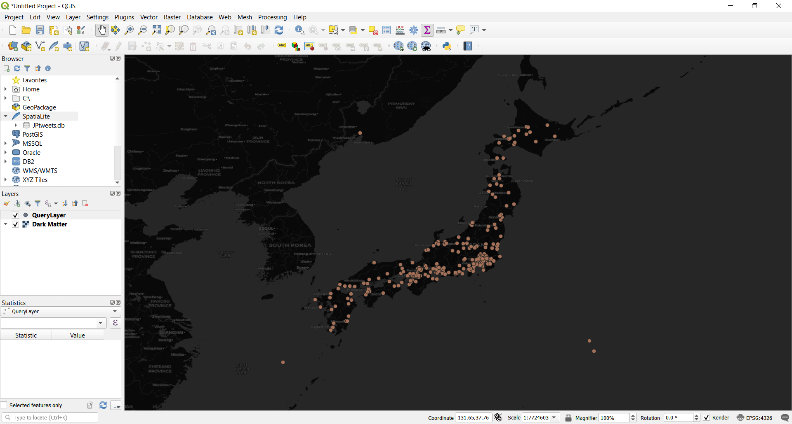

# Geo-tagged Tweets Visualization

Twitter data was retrieved using official Twitter API. A reference to the data crawling tutorial: https://github.com/jakobzhao/geog458/tree/master/labs/lab02

My data tables are retrieved tweets filtered using the geographic coordinates of Japan Island. While I do not have a research statement yet, this data and map collaboratively shows the spatial dimension of twitter activity within Japan. Not only this provides with information like “what part of Japan is most actively participating in online activity”, it also raises additional questions like “why do some parts of Japan is isolated from online activity?”.
